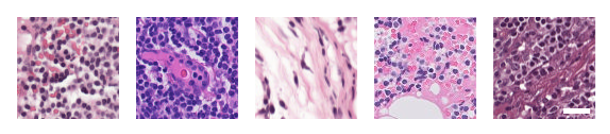
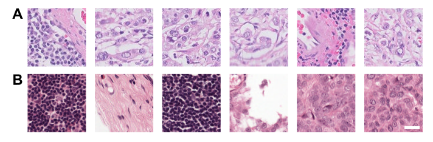
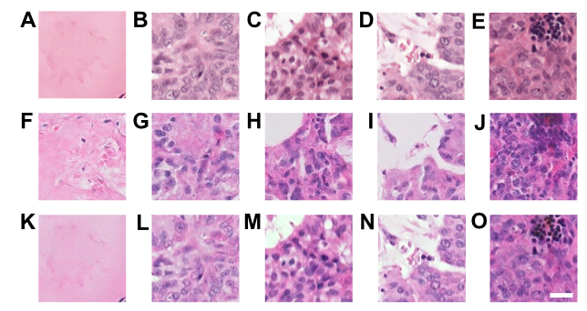
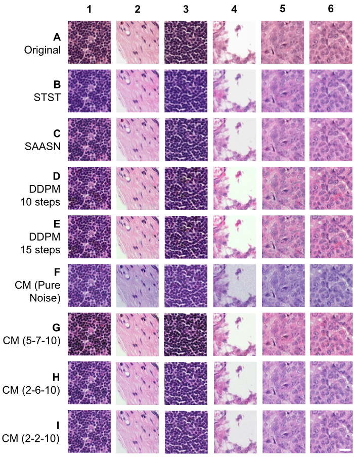

<h1 style="text-align: center;">Stain Normalization of Lymph Node Histology Images using Consistency Models</h1>

Peter Hsu, Kianoush Falahkeirhkah, Rohit Bhargava

University of Illinois Urbana-Champaign

Fall 2023 – Spring 2024

<h2>Introduction</h2>

Human tissue samples obtained from surgery are critical for proper cancer diagnosis. However, analysis of these stained tissue images creates an intense and tedious workload for pathologists. Machine learning (ML) systems can provide fast automated diagnoses and act as a validation tool to reduce human error [1]. Despite these promises, uninformative color variations can be seen in histology images between different institutions (see **Fig. 1**). These unwanted variations arise from differences in hematoxylin and eosin (H&E) staining protocols between laboratories and can reduce the accuracy of ML software [2].

**Figure 1.** Color variations present in the Camelyon17-WILDS dataset [3] among five different institutions. Scale bar: 25 µm.

Stain normalization techniques create a more uniform color distribution among images from different institutions, enabling ML systems to become more robust and reliable when applied to new datasets in the real world. The goal is to normalize images from any given institution, called the source domain, to have the same color style as a fixed, selected institution, called the target domain, without changing the morphological details, such as nuclei shape and cell positions. ML models can then be trained in the target domain style and reliably applied to any normalized source domain. In this work, we investigated the application of consistency models (CM), a new type of ML approach introduced by Song et al. [4], to stain normalization compared to existing methods using generative adversarial networks (GANs) [5] and diffusion models [6].

<h2>Prior Work</h2>

<h3>Stain Normalization</h3>

Several stain normalization techniques have been developed. Reinhard et al. [7] converted RGB images into the lαβ color space and transferred the color style of a target image to a source image by matching statistical measures. Macenko et al. [8], and Vahadane et al. [9] represent the style of an image using stain matrices which can be used to transfer color information and calculate the matrices using singular value decomposition and non-negative matrix factorization, respectively.

More recent approaches have focused on using deep learning algorithms for stain normalization. Stain-to-Stain Translation (STST) [10] uses a Pix2Pix GAN to learn how to colorize grayscale versions of a target domain dataset during training. The model is then applied to grayscale versions of a separate source domain dataset, colorizing the images using the target domain style. Self-Attentive Adversarial Stain Normalization (SAASN) [11] is a CycleGAN that uses structural similarity index (SSIM) [12] and self-attention to learn the translation between multiple color styles.

<h3>Diffusion Models</h3>

Diffusion models are a type of generative model that learns the data distribution through forward and reverse processes [6], [13], [14]. In the forward process, Gaussian noise is added to an image, and the model is trained to guess the amount of noise that was added. In the reverse process, the trained model iteratively denoises a sample of complete Gaussian noise until it becomes a recognizable image that resembles the original data distribution.

Diffusion models have been applied to image-to-image (I2I) translation, the process of translating an image from its original source domain style to a desired target domain style. SDEdit [15] adds Gaussian noise to the source domain image and performs denoising in the reverse process to translate the image into the target domain style. ILVR [16] separates the low and high frequency details at each reverse process step, replacing the low frequency information of the image being generated with that of a reference source domain image to incorporate desired details.

Application of diffusion models to stain normalization is relatively new. StainDiff [17] employs two diffusion models, each specialized for one domain, and two auxiliary generators to translate intermediate representations between domains using a cycle consistency constraint. This method, however, requires training on both domains, preventing the model from being used on an unseen domain without further training. Jeong et al. [18] use a diffusion model to colorize grayscale versions of the source domain image. To avoid colorization errors, they process the hematoxylin and eosin components separately.

<h3>Consistency Models</h3>

Consistency models (CM) [4] address the slow speeds of diffusion models by using one or a few reverse process sampling steps instead of hundreds to thousands of steps. Song et al. parameterize CMs as

$$f_\theta(\bold{x},t)=c_{skip}(t)\bold{x}+c_{out}(t)F_\theta(\bold{x},t)$$

where $f_\theta$ is the consistency model, $\bold{x}$ is the input data, $t$ is the diffusion time step, $c_{skip}$ and $c_{out}$ are differentiable functions with constraints $c_{skip}(\epsilon) = 1$ and $c_{out}(\epsilon)=0$, and $F_\theta$ is a neural network with weights $\theta$.

This parameterization conditions the model to produce the same output image regardless of the time step ($t=\epsilon$ to $t=T$) used as the input, requiring that the representations produced by the reverse process all lie on the same probability flow ordinary differential equation. This enables one-step sampling from pure noise directly to the generated image, with few-step sampling for higher quality results.

Improved consistency models (iCMs) [19] are a series of modifications to CMs to increase performance, including the use of Pseudo-Huber instead of Learned Perceptual Image Patch Similarity (LPIPS) loss. We used iCM configurations with consistency training in this work.

<h2>Methods</h2>

<h3>Dataset</h3>

The Camelyon17-WILDS dataset [3] consists of 96-by-96-pixel image patches of lymph node histology sections stained with hematoxylin and eosin. The training dataset was created using five patients from the Laboratory of Pathology East Netherlands (the target domain with the desired stain style), which resulted in 43,516 non-cancer and 40,737 metastatic breast cancer patches. The training dataset for SAASN, which was the only approach that requires both domains during training, also included seven patients from Radboud University Medical Center Nijmegen (the source domain), resulting in 38,642 normal and 45,611 cancer patches. The testing dataset comprised three patients from Radboud (the source domain), consisting of 19,794 non-cancer and 12,912 cancer patches.

<h3>Metrics</h3>

*Stain vector distance.* Stain vectors representing the hematoxylin and eosin stains were calculated using the method from Macenko et al. [8] and HistomicksTK [20]. The Euclidean distances between the average target domain stain vector and the vectors for each normalized source domain image were computed, and the mean distance with standard deviation were reported, similar to [21] and [22].

*Normalized median intensity.* Normalized median intensity (NMI) measures how consistent the nuclei colors are within a single domain, as inconsistencies can lead to failures on downstream ML tasks. Nuclei segmentation was performed using StarDist [23] and the NMI was calculated for each domain using the equation based on [22]:

$$\mathrm{NMI}(I)=\frac{\mathrm{Median}\lbrace U(i) | i \in I \rbrace}{P_{95}\lbrace U(i) | i \in I \rbrace}$$

where $I$ is the image, $U(i)$ is the average of the red, green, and blue values at pixel $i$, and $P_{95}$ is the 95th percentile. The standard deviation (SD) and standard deviation divided by the mean (CV) were calculated where lower values indicate higher color consistency.

*Nuclei color distance.* Following [24], nuclei color distance measures how different the nuclei colors are between the target and normalized source domains. The mean RGB values of the segmented nuclei were calculated for each domain, and the Euclidean distance was calculated.

*Edge preservation.* Preservation of morphological details such as nuclei shapes and positions after normalization is essential. Binary masks revealing the edges of shapes were obtained using Canny edge detection [25] from scikit-image [26], and the differences between the original source domain images and normalized versions were calculated. The mean and standard deviation of the distances were reported.

*Landmark distance.* Histogram landmark distance [27] measures the difference between the target and normalized source domains at each pixel intensity (0-255) decile. The distance is calculated using the equation from [27]:

$$\phi_c(n,t) = \frac{1}{9} \sqrt{\sum_{j \in \lbrace 10,...,90 \rbrace} (n_j - t_j)^2} $$

where $n_j$ and $t_j$ are the pixel intensity values for the j-th percentile averaged across the normalized and target domains, respectively. $c$ indicates that $\phi$ was computed on each channel (R, G, B) individually, and then $\phi_R$, $\phi_G$, and $\phi_B$ are averaged to get the final metric value.

*Classification accuracy.* A DenseNet-161 architecture with pre-trained ImageNet weights from PyTorch [28] was used. Binary classification accuracy for the presence of cancer was computed. An Adam optimizer was used at a learning rate of 1 x 10-3, weight decay of 1 x 10-2, and momentum of 0.9 with binary cross entropy loss for 5 epochs of batch size 16.

<h3>Implementation</h3>

We investigated the use of consistency models to perform stain normalization through image-to-image (I2I) translation, as compared to modern GAN and diffusion-based approaches. Our baseline comparison methods were the Identity transform, meaning that no normalization of the source domain images was performed, along with state-of-the-art GAN normalization methods STST and SAASN.

A denoising diffusion probabilistic model (DDPM) [6] with DPM-Solver [29] was trained on the target domain images only. SDEdit [30] was adapted to perform stain normalization, in which Gaussian noise was added to the source domain images and inserted into the reverse diffusion process. To avoid the alteration of structural information, the source domain images were concatenated with their grayscale version before normalization and only the RGB channels have noise added in the reverse process. This grayscale conditioning approach was inspired by [31] and [32].

Several consistency model (CM) methods were evaluated, using modifications from prior work on improved CMs (iCMs) [19]. CMs were trained on the target domain images only. Sampling using SDEdit was performed in the same fashion as the DDPM models, and the source domain images were concatenated with their grayscale versions as well.

Experiments were performed on a 16 GB NVIDIA V100 GPU from the National Center for Supercomputing Applications [33] and implemented in PyTorch [28]. Code is available at: https://github.com/peterhsu48/consistency-stainnorm.

<h2>Results</h2>

In this work, stain normalization methods were used to alter source domain images such that their new color style matches the style of a chosen target domain. By normalizing images from different institutions to a target style, ML models can be trained in the target style only, mitigating the impacts of site-specific stain differences. **Fig. 2** shows six randomly sampled patches from the target and source domains, which have distinct color styles.

**Figure 2.** Randomly sampled patches of H&E-stained lymph node tissue from the (A) target and (B) source domains. Scale bar: 25 µm.

<h3>Conditioning on Grayscale Information Preserved Histological Features</h3>

In our preliminary studies, we performed stain normalization using a DDPM with SDEdit. In **Fig. 3**, source domain images (**A-E**) were normalized by adding Gaussian noise and inserting the images into the reverse diffusion process. **Fig. 3F-J** shows that performing SDEdit without any other conditioning information resulted in output images with important histological details lost or hallucinated. For example, **Fig. 3F** contains hallucinated nuclei and tissue-like structures compared to the original image (**Fig. 3A**), and **Fig. 3I** shows red blood cells were lost in the center compared to **Fig. 3D**. When the grayscale version of the original source domain image is concatenated with the RGB input and Gaussian noise is only added to the RGB input, important histological structures are well preserved, as shown in **Fig. 3K-O**. We therefore used this grayscale conditioning strategy for all further experiments to ensure histological structures are not lost.

**Figure 3.** (**A-E**) Source domain images before normalization. (**F-J**) Normalized source domain images from a DDPM with SDEdit, which adds Gaussian noise to the input RGB images **A-E** and inserts them into the reverse process. (**K-O**) Normalized source domain images from the same DDPM but the input noised RGB images are concatenated with a non-noised, grayscale version of the input source domain image. Scale bar: 25 µm.

<h3>DDPMs and CMs Resulted in Structure-Preserving Stain Normalization</h3>

**Fig. 4** shows a sample of source domain images before (**Fig. 4A**) and after (**Fig. 4B-I**) stain normalization. The baseline methods were GAN-based approaches STST (**Fig. 4B**) and SAASN (**Fig. 4C**). DDPMs were tested with 10 (**Fig. 4D**) and 15 (**Fig. 4E**) reverse process steps. CM (Pure Noise) was the baseline CM model that starts the beginning of the reverse process ($t=0$) with pure Gaussian noise as the input RGB channels and the grayscale version of the source domain image concatenated (**Fig. 4F**). CM (x-y-z) represents models in which the sequence of reverse process time steps taken is t=x, t=y, then t=z (**Fig. 4G-I**).

**Figure 4. Randomly sampled patches of the source domain images after performing stain normalization using the investigated approaches (A-I).** Scale bar: 25 µm.

The contours of histological structures appear well preserved for all normalization approaches in **Fig. 4**. Only **Fig. 4F (1-6)** have noticeable artifacts, as the images appear to be dominated by purple and lack red hues. This was expected since the RGB input to CM (Pure Noise) was replaced with pure Gaussian noise, depriving the model of any color information. Therefore, input color information from the original source domain images is critical for reasonable stain normalization results. 

<h3>CMs Achieved Competitive Performance on Color Distances</h3>

**Table 1** shows the color distances of the investigated approaches with the top 2 approaches bolded. CM (2-2-10) achieved the best results on the eosin stain vector distance and landmark distance, and it had the second-best results on nuclei color distances for both normal and cancer patches.  The best result for the nuclei color and stain vector distances went to different approaches, making it difficult to discern the superior approach from color distances alone.

|                 | Nuclei color distance, normal | Nuclei color distance, cancer | Stain vector distance, hematoxylin | Stain vector distance, eosin | Landmark distance |
|-----------------|-------------------------------|-------------------------------|------------------------------------|------------------------------|-------------------|
| STST            | 72.3181                       | 31.2396                       | 0.1004 (0.0298)                    | 0.0799 (0.0497)              | 11.9481           |
| SAASN           | 75.8336                       | **25.7215**                   | 0.0959 (0.0436)                    | 0.0994 (0.0487)              | 11.5952           |
| DDPM 10 steps   | 89.2355                       | 43.0124                       | **0.0685 (0.0580)**                | 0.1355 (0.0594)              | 12.6611           |
| DDPM 15 steps   | 89.3257                       | 43.6034                       | **0.0681 (0.0582)**                | 0.1347 (0.0599)              | 12.6610           |
| CM (Pure Noise) | **67.2216**                   | 55.5020                       | 0.0963 (0.0462)                    | 0.1634 (0.0430)              | 14.3002           |
| CM (5-7-10)     | 105.6830                      | 40.1502                       | 0.0778 (0.0611)                    | 0.1203 (0.0610)              | 13.2984           |
| CM (2-6-10)     | 77.5669                       | 30.0129                       | 0.0793 (0.0354)                    | **0.0750 (0.0461)**          | **11.3718**       |
| CM (2-2-10)     | **70.2208**                   | **29.4940**                   | 0.0764 (0.0309)                    | **0.0707 (0.0490)**          | **11.0616**       |

**Table 1. Color distance metrics between the target and normalized source domain images for each approach with the top 2 results bolded.** The nuclei color distance is calculated separately for the normal and cancer images. The hematoxylin and eosin stain vector distances are reported as means with ±1 standard deviation in parentheses. Lower is better for all metrics.

<h3>STST Obtained Better Results on NMI Scores</h3>

In **Table 2**, the normalized median intensity (NMI) of the investigated approaches is shown. For all categories, CM (Pure Noise) had the lowest NMI scores, but this high consistency may be due to the removal of useful color variation, as the images dominated in purple color (see **Fig. 4F**). The second-best NMI scores were seen in STST, indicating that the baseline GAN method has better nuclei color consistency compared to the DDPMs and CMs. CM (2-2-10) obtained consistently lower NMI scores compared to the DDPMs for all types of patches, suggesting that CMs with earlier timesteps may have an advantage over DDPMs.

|                 | SD, normal | CV, normal | SD, cancer | CV, cancer | SD, both   | CV, both   |
|-----------------|------------|------------|------------|------------|------------|------------|
| STST            | **0.0467** | **0.0630** | **0.0505** | **0.0594** | **0.0723** | 0.0921     |
| SAASN           | 0.0651     | 0.0917     | 0.0520     | 0.0619     | 0.0877     | 0.1153     |
| DDPM 10 steps   | 0.0591     | 0.0866     | 0.0563     | 0.0691     | 0.0870     | 0.1183     |
| DDPM 15 steps   | 0.0588     | 0.0862     | 0.0567     | 0.0697     | 0.0867     | 0.1182     |
| CM (Pure Noise) | **0.0415** | **0.0561** | **0.0485** | **0.0592** | **0.0591** | **0.0766** |
| CM (5-7-10)     | 0.0704     | 0.1102     | 0.0623     | 0.0772     | 0.1066     | 0.1512     |
| CM (2-6-10)     | 0.0547     | 0.0780     | 0.0569     | 0.0694     | 0.0810     | 0.1083     |
| CM (2-2-10)     | 0.0471     | 0.0652     | 0.0535     | 0.0652     | 0.0690     | **0.0906** |

**Table 2. The normalized median intensity (NMI) of the normalized source domain dataset calculated on normal, cancer, and both classes of patches for each method.** A lower standard deviation (SD) and coefficient of variation (CV) indicates greater nuclei color consistency within the dataset. The top 2 results are bolded.

<h3>Earlier CM Timesteps Worsen Edge Preservation but are Competitive with GANs</h3>

In **Table 3**, the DDPMs, CM (5-7-10), and CM (2-6-10) achieved better edge preservation results compared to the baseline GANs. CM (Pure Noise) and CM (2-2-10) likely resulted in worse edge preservation results compared to the DDPMs and other CMs since more Gaussian noise is added to these configurations, which may destroy important histological information in the input image. This may indicate that the grayscale conditioning strategy cannot completely ensure structural preservation and that the RGB input still plays a role. Nevertheless, major histological structures for all approaches appear to be maintained qualitatively, as shown in **Fig. 4**.

|                 | Edge preservation   |
|-----------------|---------------------|
| STST            | 0.0450 (0.0093)     |
| SAASN           | 0.0270 (0.0066)     |
| DDPM 10 steps   | **0.0080 (0.0043)** |
| DDPM 15 steps   | 0.0088 (0.0043)     |
| CM (Pure Noise) | 0.0445 (0.0107)     |
| CM (5-7-10)     | **0.0073 (0.0030)** |
| CM (2-6-10)     | 0.0087 (0.0039)     |
| CM (2-2-10)     | 0.0283 (0.0102)     |

**Table 3. The edge preservation metric reported as a mean with ±1 standard deviation in parentheses.** A lower value indicates better edge preservation between the normalized and original source domain images. The top 2 results are bolded.

<h3>Repeated Early Timesteps with CMs Achieved Highest Classification Performance</h3>

**Table 4** shows the classification accuracy of the approaches. All normalization methods improve classification accuracy compared to using no normalization (Identity), further reinforcing the utility of stain normalization. Only the CMs with the earlier timesteps of $t=2$ attain higher accuracies compared to STST and SAASN, with CM (2-6-10) and CM (2-2-10) improving accuracy by about 5% and 8%, respectively, compared to SAASN.

|                 | Classification accuracy (%) |
|-----------------|-----------------------------|
| Identity        | 62.3861                     |
| STST            | 70.9136                     |
| SAASN           | 74.0048                     |
| DDPM 10 steps   | 65.2266                     |
| DDPM 15 steps   | 66.1652                     |
| CM (Pure Noise) | 64.8413                     |
| CM (5-7-10)     | 64.7435                     |
| CM (2-6-10)     | **79.1567**                 |
| CM (2-2-10)     | **82.8197**                 |

**Table 4. The classification accuracy of the approaches for metastatic breast cancer detection in lymph node histology images.** A DenseNet-161 model was trained on images from the target domain and tested on source domain images normalized with each of the investigated methods. Identity represents no normalization was performed. The top 2 results are bolded.

<h3>CMs Performed Normalization at Competitive Speeds</h3>

Approximate wall clock times for the investigated methods are shown in **Table 5**. CM approaches achieved comparable normalization times as SAASN, completing the task within 16 minutes. CMs were also faster than DDPMs, even though DPM-Solver was incorporated into the DDPMs to speed up sampling.

|                 | Normalization time (minutes) |
|-----------------|------------------------------|
| STST            | 62                           |
| SAASN           | 16                           |
| DDPM 10 steps   | 34                           |
| DDPM 15 steps   | 53                           |
| CM (Pure Noise) | 16                           |
| CM (5-7-10)     | 16                           |
| CM (2-6-10)     | 16                           |
| CM (2-2-10)     | 16                           |

**Table 5. Approximate wall clock times for performing normalization.**

<h2>Discussion</h2>

In this work, we examined the performance of consistency models (CMs) on a stain normalization task compared to modern generative adversarial network (GAN) methods and denoising diffusion probabilistic models (DDPMs). While CMs have been investigated for natural image generation from pure Gaussian noise, their use in I2I settings for stain normalization remains relatively unexplored. Here, we implemented a CM with SDEdit sampling and concatenation with grayscale conditioning information to surpass the performance of state-of-the-art GAN methods on a binary classification task.

Inspired by [31] and [32], concatenation of the input RGB image with its grayscale version preserved important histological features compared to using only the RGB image (**Fig. 3**). This grayscale conditioning strategy is important since the addition of Gaussian noise to the input RGB image may result in the occlusion of important histological features, which would be unrecoverable in the reverse diffusion process without additional conditioning information. By concatenating a non-noised grayscale version of the image, the full structural details of the tissue are supplied to the model without revealing the color information that the model is trying to predict during training.

CMs (2-2-10) achieved competitive color distances compared to the other approaches, obtaining the second-best color distances in several categories (**Table 1**). However, there was no clear superior normalization technique from evaluating the color distance metrics alone. CM (Pure Noise) had the best NMI scores (**Table 2**), but this was likely due to the lack of red hues in the normalized images, which created images with consistent colors but lacked the expected color variation seen in the other normalized images. STST obtained the second-best NMI scores, suggesting that GAN-based approaches may still offer advantages compared to DDPMs and CMs. The edge preservation metric revealed that the use of more Gaussian noise, as seen with CM (2-2-10), may result in worse structure preservation, potentially due to the noise destroying the input structural information (**Table 3**). However, this reduction in edge preservation may be negligible given that major histological structures were largely maintained from visual inspection of **Fig. 4**.

CM (2-2-10) and CM (2-6-10) achieved the first and second highest classification accuracies, respectively. This suggests that the use of earlier timesteps ($t=2$) and their repetition may be beneficial for classification performance. The addition of more Gaussian noise through earlier timesteps removes more of the original source domain image information, enabling the model to make greater changes to the input images to fill in the lost information. Such changes may result in the generation of images closer to the target domain, which is supported by observations on natural images [30]. However, the input RGB information is still critical and cannot be completely replaced with Gaussian noise, as seen by the unrealistic outputs of CM (Pure Noise).

CMs achieved faster normalization times compared to DDPMs and comparable times to the GAN-based SAASN, which is supported by the ability of CMs to perform few-step sampling due to the consistency parameterizations [4]. Fast normalization approaches will be critical for pre-processing large-scale histology datasets. Future work should focus on improving the speed of deep learning normalization approaches.

<h2>Conclusion</h2>

This work shows that consistency models offer a promising new avenue for addressing stain normalization and can potentially provide benefits over GAN and diffusion-based methods. CMs achieved higher binary classification results on cancer prediction for the Camelyon17-WILDS dataset and produced realistic tissue images. Improvements in stain normalization techniques will help enable the application of ML diagnostic models in diverse real-world settings.

<h2>Data Availability</h2>

Code for the modified CMs is available at https://github.com/peterhsu48/consistency-stainnorm, which was based on the code from https://github.com/openai/consistency_models. STST was implemented using code from https://github.com/pegahsalehi/Stain-to-Stain-Translation, and SAASN was implemented from https://github.com/4m4n5/saasn-stain-normalization. DDPMs were trained using code from https://github.com/ermongroup/ddim/tree/main with DPM-Solver from https://github.com/LuChengTHU/dpm-solver. The Camelyon17-WILDS dataset can be found at https://wilds.stanford.edu. 

<h2>Acknowledgements</h2>

This work utilizes resources supported by the National Science Foundation’s Major Research Instrumentation program, grant #1725729, as well as the University of Illinois at Urbana-Champaign.

<h2>References</h2>

[1]	J. van der Laak, G. Litjens, and F. Ciompi, “Deep learning in histopathology: the path to the clinic,” Nat. Med., vol. 27, no. 5, pp. 775–784, May 2021, doi: 10.1038/s41591-021-01343-4.

[2]	D. Tellez et al., “Quantifying the effects of data augmentation and stain color normalization in convolutional neural networks for computational pathology,” Med. Image Anal., vol. 58, p. 101544, Dec. 2019, doi: 10.1016/j.media.2019.101544.

[3]	P. W. Koh et al., “WILDS: A Benchmark of in-the-Wild Distribution Shifts,” July 16, 2021, arXiv: arXiv:2012.07421. doi: 10.48550/arXiv.2012.07421.

[4]	Y. Song, P. Dhariwal, M. Chen, and I. Sutskever, “Consistency Models,” May 31, 2023, arXiv: arXiv:2303.01469. doi: 10.48550/arXiv.2303.01469.

[5]	I. J. Goodfellow et al., “Generative Adversarial Networks,” June 10, 2014, arXiv: arXiv:1406.2661. doi: 10.48550/arXiv.1406.2661.

[6]	J. Ho, A. Jain, and P. Abbeel, “Denoising Diffusion Probabilistic Models,” Dec. 16, 2020, arXiv: arXiv:2006.11239. doi: 10.48550/arXiv.2006.11239.

[7]	E. Reinhard, M. Adhikhmin, B. Gooch, and P. Shirley, “Color transfer between images,” IEEE Comput. Graph. Appl., vol. 21, no. 5, pp. 34–41, July 2001, doi: 10.1109/38.946629.

[8]	M. Macenko et al., “A method for normalizing histology slides for quantitative analysis,” in 2009 IEEE International Symposium on Biomedical Imaging: From Nano to Macro, June 2009, pp. 1107–1110. doi: 10.1109/ISBI.2009.5193250.

[9]	A. Vahadane et al., “Structure-Preserving Color Normalization and Sparse Stain Separation for Histological Images,” IEEE Trans. Med. Imaging, vol. 35, no. 8, pp. 1962–1971, Aug. 2016, doi: 10.1109/TMI.2016.2529665.

[10]	P. Salehi and A. Chalechale, “Pix2Pix-based Stain-to-Stain Translation: A Solution for Robust Stain Normalization in Histopathology Images Analysis,” in 2020 International Conference on Machine Vision and Image Processing (MVIP), Feb. 2020, pp. 1–7. doi: 10.1109/MVIP49855.2020.9116895.

[11]	A. Shrivastava et al., “Self-attentive Adversarial Stain Normalization,” in Pattern Recognition. ICPR International Workshops and Challenges, A. Del Bimbo, R. Cucchiara, S. Sclaroff, G. M. Farinella, T. Mei, M. Bertini, H. J. Escalante, and R. Vezzani, Eds., Cham: Springer International Publishing, 2021, pp. 120–140. doi: 10.1007/978-3-030-68763-2_10.

[12]	Z. Wang, A. C. Bovik, H. R. Sheikh, and E. P. Simoncelli, “Image quality assessment: from error visibility to structural similarity,” IEEE Trans. Image Process., vol. 13, no. 4, pp. 600–612, Apr. 2004, doi: 10.1109/TIP.2003.819861.

[13]	J. Sohl-Dickstein, E. Weiss, N. Maheswaranathan, and S. Ganguli, “Deep Unsupervised Learning using Nonequilibrium Thermodynamics,” in Proceedings of the 32nd International Conference on Machine Learning, PMLR, June 2015, pp. 2256–2265. Accessed: Sept. 27, 2025. [Online]. Available: https://proceedings.mlr.press/v37/sohl-dickstein15.html

[14]	Y. Song, J. Sohl-Dickstein, D. P. Kingma, A. Kumar, S. Ermon, and B. Poole, “Score-Based Generative Modeling through Stochastic Differential Equations,” presented at the International Conference on Learning Representations, Oct. 2020. Accessed: Sept. 27, 2025. [Online]. Available: https://openreview.net/forum?id=PxTIG12RRHS&utm_campaign=NLP%20News&utm_medium=email&utm_source=Revue%20newsletter

[15]	C. Meng et al., “SDEdit: Guided Image Synthesis and Editing with Stochastic Differential Equations,” Jan. 05, 2022, arXiv: arXiv:2108.01073. doi: 10.48550/arXiv.2108.01073.

[16]	J. Choi, S. Kim, Y. Jeong, Y. Gwon, and S. Yoon, “ILVR: Conditioning Method for Denoising Diffusion Probabilistic Models,” Sept. 15, 2021, arXiv: arXiv:2108.02938. doi: 10.48550/arXiv.2108.02938.

[17]	Y. Shen and J. Ke, “StainDiff: Transfer Stain Styles of Histology Images with Denoising Diffusion Probabilistic Models and Self-ensemble,” in Medical Image Computing and Computer Assisted Intervention – MICCAI 2023, H. Greenspan, A. Madabhushi, P. Mousavi, S. Salcudean, J. Duncan, T. Syeda-Mahmood, and R. Taylor, Eds., Cham: Springer Nature Switzerland, 2023, pp. 549–559. doi: 10.1007/978-3-031-43987-2_53.

[18]	J. Jeong, K. D. Kim, Y. Nam, C. E. Cho, H. Go, and N. Kim, “Stain normalization using score-based diffusion model through stain separation and overlapped moving window patch strategies,” Comput. Biol. Med., vol. 152, p. 106335, Jan. 2023, doi: 10.1016/j.compbiomed.2022.106335.

[19]	Y. Song and P. Dhariwal, “Improved Techniques for Training Consistency Models,” Oct. 22, 2023, arXiv: arXiv:2310.14189. doi: 10.48550/arXiv.2310.14189.

[20]	F. Pourakpour, Á. Szölgyén, R. Nateghi, D. A. Gutman, D. Manthey, and L. A. Cooper, “HistomicsTK: A Python toolkit for pathology image analysis algorithms,” SoftwareX, vol. 31, p. 102318, Sept. 2025, doi: 10.1016/j.softx.2025.102318.

[21]	M. Salvi, N. Michielli, and F. Molinari, “Stain Color Adaptive Normalization (SCAN) algorithm: Separation and standardization of histological stains in digital pathology,” Comput. Methods Programs Biomed., vol. 193, p. 105506, Sept. 2020, doi: 10.1016/j.cmpb.2020.105506.

[22]	Md. Z. Hoque, A. Keskinarkaus, P. Nyberg, and T. Seppänen, “Retinex model based stain normalization technique for whole slide image analysis,” Comput. Med. Imaging Graph., vol. 90, p. 101901, June 2021, doi: 10.1016/j.compmedimag.2021.101901.

[23]	U. Schmidt, M. Weigert, C. Broaddus, and G. Myers, “Cell Detection with Star-Convex Polygons,” in Medical Image Computing and Computer Assisted Intervention – MICCAI 2018, A. F. Frangi, J. A. Schnabel, C. Davatzikos, C. Alberola-López, and G. Fichtinger, Eds., Cham: Springer International Publishing, 2018, pp. 265–273. doi: 10.1007/978-3-030-00934-2_30.

[24]	A. Gupta et al., “GCTI-SN: Geometry-inspired chemical and tissue invariant stain normalization of microscopic medical images,” Med. Image Anal., vol. 65, p. 101788, Oct. 2020, doi: 10.1016/j.media.2020.101788.

[25]	J. Canny, “A Computational Approach to Edge Detection,” IEEE Trans. Pattern Anal. Mach. Intell., vol. PAMI-8, no. 6, pp. 679–698, Nov. 1986, doi: 10.1109/TPAMI.1986.4767851.

[26]	S. van der Walt et al., “scikit-image: image processing in Python,” PeerJ, vol. 2, p. e453, June 2014, doi: 10.7717/peerj.453.

[27]	A. Basavanhally and A. Madabhushi, “EM-based segmentation-driven color standardization of digitized histopathology,” in Medical Imaging 2013: Digital Pathology, SPIE, Mar. 2013, pp. 152–163. doi: 10.1117/12.2007173.

[28]	J. Ansel et al., “PyTorch 2: Faster Machine Learning Through Dynamic Python Bytecode Transformation and Graph Compilation,” in Proceedings of the 29th ACM International Conference on Architectural Support for Programming Languages and Operating Systems, Volume 2, in ASPLOS ’24, vol. 2. New York, NY, USA: Association for Computing Machinery, Apr. 2024, pp. 929–947. doi: 10.1145/3620665.3640366.

[29]	C. Lu, Y. Zhou, F. Bao, J. Chen, C. Li, and J. Zhu, “DPM-Solver: A Fast ODE Solver for Diffusion Probabilistic Model Sampling in Around 10 Steps,” Oct. 13, 2022, arXiv: arXiv:2206.00927. doi: 10.48550/arXiv.2206.00927.

[30]	C. Meng et al., “SDEdit: Guided Image Synthesis and Editing with Stochastic Differential Equations,” Jan. 05, 2022, arXiv: arXiv:2108.01073. doi: 10.48550/arXiv.2108.01073.

[31]	H. Carrillo, M. Clément, A. Bugeau, and E. Simo-Serra, “Diffusart: Enhancing Line Art Colorization with Conditional Diffusion Models,” in 2023 IEEE/CVF Conference on Computer Vision and Pattern Recognition Workshops (CVPRW), June 2023, pp. 3486–3490. doi: 10.1109/CVPRW59228.2023.00351.

[32]	C. Saharia et al., “Palette: Image-to-Image Diffusion Models,” May 03, 2022, arXiv: arXiv:2111.05826. doi: 10.48550/arXiv.2111.05826.

[33]	V. Kindratenko et al., “HAL: Computer System for Scalable Deep Learning,” in Practice and Experience in Advanced Research Computing 2020: Catch the Wave, in PEARC ’20. New York, NY, USA: Association for Computing Machinery, July 2020, pp. 41–48. doi: 10.1145/3311790.3396649.

© 2025 by Peter Hsu. All Rights Reserved.
