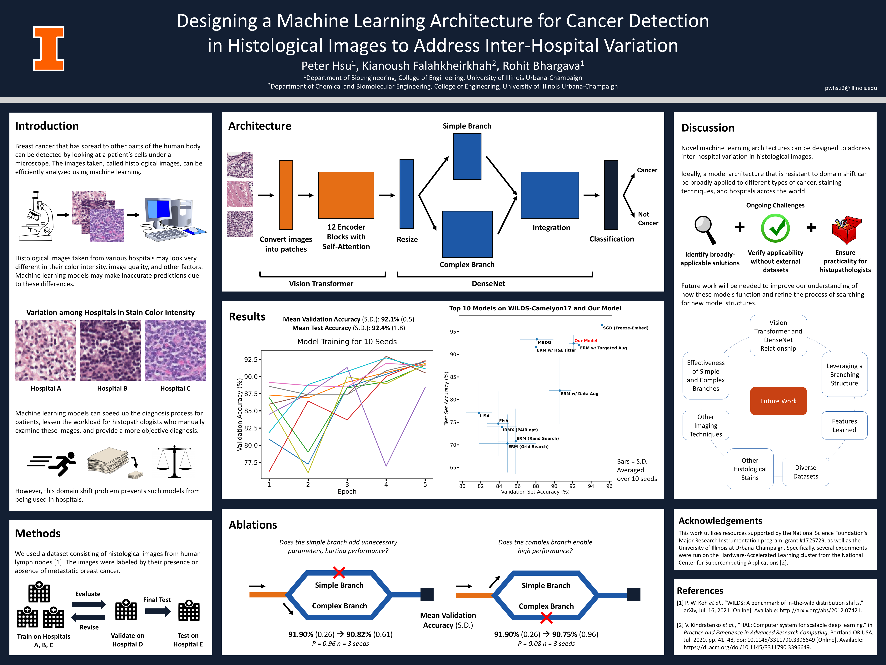

<h1 style="text-align: center;">Designing a Machine Learning Architecture for Cancer Detection in Histological Images to Address Inter-Hospital Variation</h1>

Peter Hsu, Kianoush Falahkheirkhah, Rohit Bhargava

University of Illinois Urbana-Champaign

Fall 2022 - Spring 2023

**View as PDF here:** [https://peterhsu48.github.io/files/PeterHsuPoster2023.pdf](https://peterhsu48.github.io/files/PeterHsuPoster2023.pdf)

**GitHub:** [https://github.com/peterhsu48/vit-densenet](https://github.com/peterhsu48/vit-densenet)